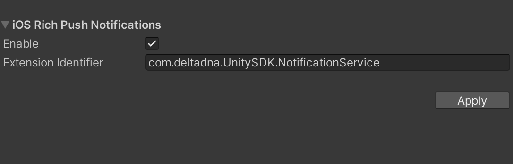

## deltaDNA Unity SDK

The repository contains sources for the deltaDNA Unity SDK.  The SDK is distributed as a unitypackage file which can be downloaded from GitHub [releases](https://github.com/deltaDNA/unity-sdk/releases). Import into Unity with Assets->Import Package->Custom Package. If you are updating the SDK it is recommended to remove the *Assets/DeltaDNA* and *Assets/DeltaDNAAds* folders before importing the new package.

deltaDNA SDK [Download](https://github.com/deltaDNA/unity-sdk/releases)

The analytics SDK is supported in both Unity 4, Unity 5, 201x and 2020.

## Contents

* [Analytics](#analytics)
* [Quick Start](#quick-start)
    * [Custom Events](#custom-events)
    * [Tracking Revenue](#tracking-revenue)
    * [Event Triggers](#event-triggers)
    * [Engage](#engage)
    * [Cross Promotion](#cross-promotion)
* [iOS Integration](#ios-integration)
    * [Push Notifications](#push-notifications)
    * [Unity 4.7 iOS](#unity-4.7-ios)
* [Android Integration](#android-integration)
    * [Amazon](#amazon)
    * [Push Notifications](#push-notifications)
    * [Permissions](#permissions)
    * [Unity 4.7 Android](#unity-4.7-android)
* [Forgetting a User (GDPR)](#forgetting-a-user-(gdpr))
* [Migrations](#migrations)
    * [4.2](#version-42)
    * [4.3](#version-43)
    * [4.7](#version-47)
    * [4.8](#version-48)
    * [4.10](#version-410)
* [Editor Integration](#editor-integration) 
    * [Viewing events and parameters in the Editor](#viewing-game-parameters-and-events-in-the-unity-editor)
* [License](#license)

## Analytics

Our analytics SDK is written entirely in Unity with no native code requirements.  Out of the box it runs on any platform that Unity supports.  The easiest way to get started is to download the unitypackage file and import into your Unity project.

## Quick Start

For all the information on how to use the analytics SDK, refer to our documentation [portal](http://docs.deltadna.com/advanced-integration/unity-sdk/).

Checkout `BasicExample` class in `Assets\DeltaDNA\Example` to see how to use the SDK. At a minimum you will want to set the environment, Collect, and Engage URLs in the configuration UI accessible from the Editor under *DeltaDNA -> Configuration*. Finally you will need to start the SDK from a custom `MonoBehaviour`.

```csharp
DDNA.Instance.StartSDK();
```

On the first run this will create new user id and send a `newPlayer` event. On every call it will send a `gameStarted` and `clientDevice` event.

### Custom Events

You can easily record custom events by using the `GameEvent` class.  Create a `GameEvent` with the name of your event schema.  Call `AddParam` to add custom event parameters to the event.  For example:

```csharp
var gameEvent = new GameEvent("myEvent")
    .AddParam("option", "sword")
    .AddParam("action", "sell");

DDNA.Instance.RecordEvent(gameEvent);
```

### Tracking Revenue

Revenue and IAP data should be tracked on the `transaction` event. This event contains nested objects that allow for the tracking of both virtual and real currency spending. As detailed in the [ISO 4217 standard](https://en.wikipedia.org/wiki/ISO_4217#Active_codes "ISO 4217 standard"), not all real currencies have 2 minor units and thus require conversion into a common form. The `Product.ConvertCurrency()` method can be used to ensure the correct currency value is sent. 

For example, to track a purchase made with 550 JP¥: 

```csharp
new Product().SetRealCurrency("JPY", Product.ConvertCurrency("JPY", 550)) // realCurrencyAmount: 550
```

And to track a $4.99 purchase: 

```csharp
new Product().SetRealCurrency("USD", Product.ConvertCurrency("USD", 4.99)) // realCurrencyAmount: 499
```

These will be converted automatically into a `convertedProductAmount` parameter that is used as a common currency for reporting. 

Receipt validation can also be performed against purchases made via the Google Play Store on Android and the Apple App Store on iOS. 

#### Android (Google Play Store) 

To validate in-app purchases made through the Google Play Store the following parameters should be added to the `transaction` event:

* `transactionServer` - the server for which the receipt should be validated against, in this case 'GOOGLE'
* `transactionReceipt` - the purchase data as a string 
* `transactionReceiptSignature` - the in-app data signature 

#### iOS (Apple App Store)

To validate in-app purchases made through the Apple App Store the following parameters should be added to the `transaction` event:

* `transactionServer` - the server for which the receipt should be validated against, in this case 'APPLE'
* `transactionReceipt` - the purchase data as a string not as nested JSON 
* `transactionID` - the ID of the in-app purchase e.g 100000576198248

When a `transaction` event is received with the above parameters, the receipt will be checked against the relevant store and the resulting event will be tagged with a `revenueValidated` parameter to allow for the filtering out of invalid revenue. 

### Event Triggers
All `RecordEvent` methods return an `EventAction` instance on which `EventActionHandler`s can be registered through the `Add` method, for handling triggers which match the conditions setup on the Platform for Event-Triggered Campaigns. Once all the handlers have been registered `Run()` needs to be called in order for the event triggers to be evaluated and for a matching handler to be run. This happens on the client without any network use and as such it is instantaneous.
```csharp
RecordEvent(new GameEvent("missionStarted").AddParam("missionLevel", 1))
    .Add(new GameParametersHandler(gameParameters => {
        // do something with the game parameters
    }))
    .Add(new ImageMessageHandler(DDNA.Instance, imageMessage => {
        // the image message is already prepared so it will show instantly
        imageMessage.Show();
    }))
    .Run();
```

In Addition to the above mechanism, default handlers can be specified. These will be used every time `Run()` is called on an EventAction, after any handlers which have been registered via the `Add` method.
These should be Specified before the SDK is started so they can be used to handle internal events such as `newPlayer` and `gameStarted` but they must be registered after the SDK is initialized. 
You can specify these handlers like so: 

```csharp 
        DDNA.Instance.Settings.DefaultImageMessageHandler =
            new ImageMessageHandler(DDNA.Instance, imageMessage =>{
                // the image message is already prepared so it will show instantly
                imageMessage.Show();
            });
        DDNA.Instance.Settings.DefaultGameParameterHandler = new GameParametersHandler(gameParameters =>{
            // do something with the game parameters
        });
```


 

### Engage

Change the behaviour of the game with an `Engagement`.  For example:

```csharp
var engagement = new Engagement("gameLoaded")
    .AddParam("userLevel", 4)
    .AddParam("experience", 1000)
    .AddParam("missionName", "Disco Volante");

DDNA.Instance.RequestEngagement(engagement, (response) =>
{
    // Response is a Dictionary<string, object> of key-values returned from Engage.
    // It will be empty if no matching campaign was found or an error occurred.
});
```

If you need more control over the response from Engage use `DDNA.Instance.RequestEngagement(Engagement engagement, Action<Engagement> onCompleted, Action<Exception> onError)`.  This calls the onCompleted callback with the Engagement containing the response from Engage.  You can also handle if any errors occur.  With this method it is possible to optionally create an `ImageMessage` if the Engagement supports it.  For example:

```csharp
var engagement = new Engagement("imageMessage")
    .AddParam("userLevel", 4)
    .AddParam("experience", 1000)
    .AddParam("missionName", "Disco Volante");

DDNA.Instance.RequestEngagement(engagement, (response) => {

    ImageMessage imageMessage = ImageMessage.Create(response);

    // Check we got an engagement with a valid image message.
    if (imageMessage != null) {
        imageMessage.OnDidReceiveResources += () => {
            // Can show once we've got the resources.
            imageMessage.Show();
        };
        // Download the image message resources.
        imageMessage.FetchResources();
    }
    else {
        // Engage didn't return an image message.
    }
}, (exception) => {
    Debug.Log("Engage reported an error: "+exception.Message);
});
```

### Cross Promotion
To register a user for cross promotion between multiple games the user needs to sign into a service which can provide unique user identification. Once the user has been signed in the ID can be set in the SDK:
```csharp
DDNA.Instance.CrossGameUserId = crossGameUserId;
```
On the next session the SDK will download a new configuration with cross promotion campaigns relevant to the user.

When a cross promotion campaign with a store action has been acted on by the user, the SDK will return the store link for the currently set platform:
```csharp
DDNA.Instance
    .RecordEvent("event")
    .Add(new ImageMesageHandler(DDNA.Instance, imageMessage => {
        imageMessage.OnStore += (args) => {
            // act on store action with value 'args.ActionValue'
        };
        imageMessage.Show();
    }))
    .Run();
```

## iOS Integration

### Push Notifications

To support iOS push notifications you need to call `IosNotifications.RegisterForPushNotifications()`.  This uses Unity's `NotificationServices` to request a push token and then reports it back to us in a `notificationServices` event.  You will also need to enter the game's associated APNs certificate into our platform.

We record if your game was started by the player clicking on a push notification.  However to make this work properly the `DDNA` game object has to be loaded early on in the scene which the game launches with.  This can be achieved by adding a delegate to `OnDidLaunchWithPushNotification` in the `Awake` method of a game object that manages the SDK.

To remove push notification support for iOS the following files will need to be removed from the project:
* `Assets/DeltaDNA/Notifications/IosNotifications.cs`
* `Assets/DeltaDNA/Editor/iOS/EnableNotificationsPostProcessBuild.cs`
  
After the deletion of these two files iOS push notifications will no longer be enabled for the project and the APIs will not be available. Please note that when updating the SDK these files will be re-imported back into the project.

### Supporting Rich Push Notifications (iOS10+)

The DeltaDNA service allows you to send notifications with additional content such as images to take advantage of the Rich Push functionality that is available from iOS 10 onwards.  To leverage this capability you will need to take the following steps. (Note that iOS rich push notification functionality is only supported in Unity Editor version 2018.4 or higher)

1. Open the DeltaDNA configuration panel, and enable iOS rich push notifications.
2. Add a custom bundle identifier for the extension. By default this will be set to your main app identifier appended with `.NotificationService`, for example `com.unity3d.deltaDNA.example.NotificationService`.



3. Build the iOS project. 
4. Change the Xcode build system within Xcode (File -> Project Settings -> Build System) to be the legacy build system.


### Unity 4.7 iOS

Although no longer officially supported the sdk will build with Unity 4.7.2, but you will need to make a couple of manual changes:
  * Move files under Assets/DeltaDNA/[Ads]/Plugins/iOS to Assets/Plugins/iOS.
  * The UnityJarResolver will run and generate a Podfile, but it won't build the project.  Edit the Podile and set "integrate_targets => *true*", then run pod install manually from the command line.  Open the resulting workspace.
  * Under Build Phases -> Compile Sources add the -fobj-arc flag to DDNAUnityNotificationsPlugin.m.

## Android Integration

### Amazon
When building an APK to be distributed on the Amazon Appstore then the platform needs to be changed to the `Platform.AMAZON` enum before `StartSDK` is called.
```csharp
DDNA.Instance.Platform = DeltaDNA.Platform.AMAZON;
DDNA.Instance.StartSDK();
```

### Android Dependencies 

#### v5.0.7 onwards

The android dependencies for this SDK are fetched using Unity's gradle build. This is achieved through a custom gradle template file - this will be copied into your assets folder when you apply the Android notification settings.

If the SDK detects you already have a gradle template file, it will not copy the file to avoid overwriting your existing code. In order to use notifications with the deltaDNA SDK you will need to add our notifications plugin manually to this template, using the provided templates for reference (these are found in `DeltaDNA/Runtime/Plugins/Android`).

If you are upgrading from a version previous to 5.0.7, you may need to remove the assets copied by previous versions of the SDK, and remove the resolver mentioned below. If you then apply the notification settings,
the new structure will be copied to your assets folder as above.

As of 5.0.7 we no longer use the Unity Jar Resolver.

#### < v5.0.6

Any library dependencies such as Google's Firebase (Google Play Services) are handled by Google's [Unity Jar Resolver](https://github.com/googlesamples/unity-jar-resolver) plugin. The libraries will be automatically downloaded into the *Assets/Plugins/Android* folder. If you have other Unity plugins in your application which don't use the Resolver for downloading dependencies you may want to consider using the Resolver to manage their dependencies as well, otherwise you may have to manually resolve any conflicts.

> Note that occassionaly there can be conflicts between different versions of the resolver, if other plugins are included that also use it. If such conflicts occur, you can safely remove the bundled version of the resolver from the deltaDNA plugin and use one from another source, and it should still resolve the DeltaDNA plugin dependencies correctly.

### Push Notifications

Our push notifications use Firebase messaging (this was changed in version 4.3, if you're upgrading see the migration [guide](#version-4.3) below). In order to configure notifications you will need to set the *Application* and *Sender IDs* from the configuration UI, which can be accessed from the Unity Editor menu under *DeltaDNA -> Configure*. The IDs can be found in the Firebase Console for your application ([1](Docs/firebase_console_1.png), [2](Docs/firebase_console_2.png), and [3](Docs/firebase_console_3.png)). Pressing *Apply* will persist the changes to resource files in your project, which should be committed to source control.

If your application is setup using the Google Cloud Console you can find instructions [here](https://developers.google.com/cloud-messaging/android/android-migrate-fcm#import_your_gcm_project_as_a_firebase_project) on how to migrate the project to Firebase. Firebase projects are backwards compatible with applications using Google Cloud Messaging.

The style of the push notifications can be changed by overriding the behaviour of the library. Instructions on how to do this can be found [here](https://github.com/deltaDNA/android-sdk/tree/master/library-notifications#unity). Once you have added either the modified library or added the new classes as a separate library you will need to change the *Listener Service* field in the configuration to the fully qualified name of your new class.

If you no longer wish to use push notifications on Android then you can remove the *Assets/Plugins/Android/deltadna-sdk-unity-notifications* folder (and *Assets/DeltaDNA/Editor/Android/Dependencies.xml* if you are using a version of the SDK <5.0.7) from the project to decrease the number of methods and the APK size of your game.

#### Existing Firebase Cloud Messaging SDK 
If you already use Firebase's Cloud Messaging SDK, you may experience issues receiving notifications using deltaDNA's SDK, as only one receiver can use each Firebase Cloud Messaging configuration in an application at a time. To fix this, you can either remove your existing Firebase Cloud Messaging SDK, or you will need to create a separate project for deltaDNA with a new sender ID in the Firebase Console. If you choose to create a new project, make sure that the configuration for deltaDNA in the Unity Editor is updated to use the new project, and ensure the server API key under the Identities section of the deltaDNA portal is updated to use details from the same project.

### MultiDex; Working Around Android's 65k Method Limit
1. Export your Unity project using the *Gradle* build system. These options can be found in the *Build Settings* dialog.
2. Open the exported project in Android Studio and select to use the Gradle wrapper if asked to.
3. Open the top-level *build.gradle* file for your project and apply the MultiDex workaround as described [here](https://developer.android.com/studio/build/multidex.html#mdex-gradle).

### Permissions

The permissions which the Android libraries request can be overriden through the use of the [Android manifest merger](http://tools.android.com/tech-docs/new-build-system/user-guide/manifest-merger). For example, if you would like to remove the `maxSdkVersion` attribute for the `WRITE_EXTERNAL_STORAGE` permission then you can specify the following in your manifest file:
```xml
<uses-permission
    android:name="android.permission.WRITE_EXTERNAL_STORAGE"
    tools:remove="android:maxSdkVersion"/>
```

In case the above still causes conflicts during manifest merging then the following can be used in the manifest file instead:
```xml
<uses-permission
    android:name="android.permission.WRITE_EXTERNAL_STORAGE"
    tools:merge="override"/>
```

Some ad networks will also try to request additional permissions, such as `android.permission.READ_PHONE_STATE`, `android.permission.GET_ACCOUNTS`, `android.permission.ACCESS_COARSE_LOCATION`, and `android.permission.ACCESS_FINE_LOCATION`. You may remove these from your application by adding the following lines to your manifest like in the previous case:
```java
<uses-permission
    android:name="android.permission.READ_PHONE_STATE"
    tools:node="remove"/>
```
You will need to do this for each permission that you would like to remove. Please note that with some of these permissions removed the performance of the ad networks could decrease.

### Unity 4.7 Android
When using an older version of Unity, such as 4.7, the following steps need to be followed in order to include our SDKs in a project:
1. Install Android SDK Tools revision 25.2.5 for [Windows](https://dl.google.com/android/repository/tools_r25.2.5-windows.zip)|[Linux](https://dl.google.com/android/repository/tools_r25.2.5-linux.zip)|[Mac OS X](https://dl.google.com/android/repository/tools_r25.2.5-macosx.zip).
2. Open the Android SDK Manager.
3. Install *Android SDK Platform-tools 27*, *Android SDK Build-tools 27.0.2*, *SDK Platform 26*, *Android Support Repository*, and *Google Repository*.
4. Point the Unity Editor to use the newly installed Android SDK Tools.
5. In the Unity Editor set the *Minimum API Level* to *15*.

## Forgetting a User (GDPR)
If a user no longer wishes to be tracked and would like to be forgotten the `ForgetMe()` API can be used. This will stop the SDK from sending/receiving any further information to/from the Platform, as well as initiating a data deletion request on behalf of the user. The SDK will continue to work as it normally would, without any additional work required.
If a user only wants to stop sending new data, consenting to keep already collected data in our system, the `StopTrackingMe()` method can be used instead. This will function the same as `ForgetMe()`, except the data deletion request will not be sent, thus any data associated with that user will remain on the platform. It is possible to initiate a `ForgetMe()` request after the `StopTrackingMe()` request if requested by the user.

If the game supports changing of users then calling `StartSdk(userID)` with a new user ID or `ClearPersistentData()` will restore the previous SDK functionality.
 
## Migrations

### Version 4.3
Between version 4.2 and version 4.3 we updated our push notifications to use Firebase (`play-services-*-10.2`). This requires changing the way push notification integration works. To better manage the Android dependencies we now use Google's [Unity Jar Resolver](https://github.com/googlesamples/unity-jar-resolver).  This allows other plugins to also specify dependencies on the Firebase/Play-Services libraries and the Unity Jar Resolver will work out which library to use, hopefully reducing duplicate library errors at build time.

### Version 4.7
*IosNetworksLoadHelper.cs* should be deleted from *Assets/DeltaDNA/Ads/Editor/Menus/Networks/* as the file has been replaced by *InitialisationHelper.cs*.

### Version 4.8
* *Assets/DeltaDNA* and *Assets/DeltaDNAAds* should be deleted before importing the new SDK to avoid class conflicts and retaining unused files in the project.
* *DDNA.StartSDK()* methods which take the environment key, Collect, and Engage URLs have been deprecated in favour of configuring these through the UI accessed from the Editor menu under *DeltaDNA -> Configure* and a simpler *DDNA.StartSDK()* method.

### Version 4.10
* `RecordEvent` methods have been changed to return an `EventAction` object, which can be used for Event-Triggered Campaigns. This means that chaining calls on the `DDNA` SDK instance after calling `RecordEvent` is no longer supported.

#### SDK Health Check
You can run a health check once you've upgraded the SDK to identify mistakes related to previous versions, such as conflicting configuration entries and duplicate libraries. It can be accessed from the Editor menu under *DeltaDNA -> Health Check SDK*. Please note that there could still be issues with your project which the utility may be unable to detect. Always consult the documentation for more details.

#### Android Dependencies
After importing the new DeltaDNA SDK package into your project make sure to remove the old *deltadna-sdk-notifications* AAR file from *Assets/DeltaDNA/Plugins/Android*. You also need to remove any *play-services* and *support* AAR and JAR libraries in that location as they will cause conflicts with the libraries downloaded by the Unity Jar Resolver.


#### Android Notifications
We have added a UI for configuring push notifications on Android, which can be accessed from the menu of the Unity Editor under *DeltaDNA -> Configure*. You will need to fill in the Application and Sender IDs from the Firebase Console for your application if you'd like to use notifications or have been using them with a previous version of our SDK.

We highly recommend removing any entries previously added for DeltaDNA notifications from the *AndroidManifest.xml* file in *Assets/Plugins/Android* as they may conflict with the Firebase implementation. If you never added anything else to the manifest file then you can probably remove it altogether. For more details on which XML attributes to remove take a look [here](https://github.com/deltaDNA/android-sdk/blob/master/docs/migrations/4.3.md#manifest). In addition you will also be able to remove the *string* resource from *Assets/Plugins/Android/res/values* which contains your application's Sender ID.

If you no longer wish to use notifications then remove the *Assets/Plugins/Android/deltadna-sdk-unity-notifications* and *Assets/DeltaDNA/Plugins/Android* folders from your project.

## Editor Integration
### Viewing game parameters and events in the Unity editor

 ## Editor Integration
### Viewing event schema in the Unity editor
Your event schema can be viewed without leaving the Unity editor! In order to use this feature, you will need to set up an API key in the deltaDNA platform . Please see [here](https://docs.deltadna.com/introduction-to-the-platform-api/) for details on how to do this. 

Once the API key has been configured, it can be entered in the Unity editor under "DeltaDNA" -> "Event Definitions...". Once entered, you can select the environment that you'd like to see the event schema for.

The settings for this feature are stored in `ddna_api_configuation.xml` - please commit this file to source control after you have set your API Key through that menu.

## License

The sources are available under the Apache 2.0 license.

By integrating, accessing, or using the deltaDNA UA SDK, you acknowledge and agree that (1) your access to and use of the deltaDNA UA SDK is governed by Unity’s Monetization Terms of Service, available [here](https://unity3d.com/legal/monetization-services-terms-of-service), and that such service is an Experimental Service (as defined therein); and (2) you will not access or use the deltaDNA UA SDK in connection with any application that is “directed to children” under the age of 13 or would otherwise be subject to the Children’s Online Privacy Protection Act of 1998, or with any application designated as a “Kids” or “Family” application in the Apple App Store or Google Play Store.

## Contact Us

For more information, please visit [deltadna.com](https://deltadna.com/). For questions or assistance, please email us at [support@deltadna.com](mailto:support@deltadna.com).
